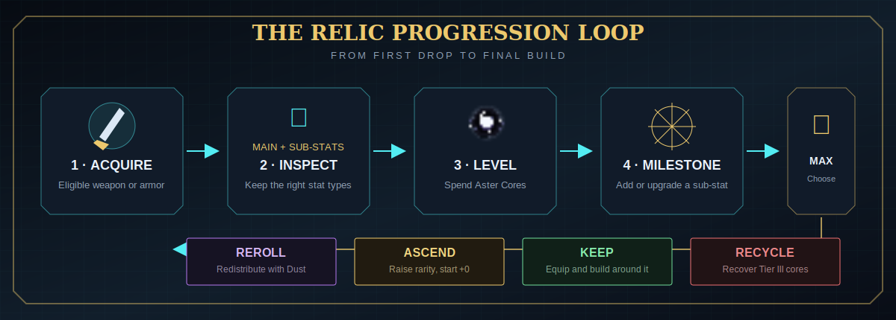

<section class="relic-hero">
  

    
The complete relic field guide

    <h1>Forge power. Rewrite fate.</h1>
    
Turn compatible weapons and armor into long-term RPG gear. Hunt upgrade materials, shape a build through milestone rolls, ascend rarity, and use Dust to redistribute a finished relic's power.

    

      <a class="relic-button" href="getting-started/quick-start/">Begin the first relic →</a>
      <a class="relic-button relic-button--ghost" href="relics/optimization/">Buildcrafting guide</a>
      <a class="relic-button relic-button--ghost" href="changelog/">Release timeline</a>
    

  

  

    

<small>Aster Core II</small>

    

<small>Resonance Core VI</small>

    

<small>Dust of Enlightenment</small>

  

</section>

## Choose your path

  

New adventurer
<h3>Your first relic</h3>
Install the dependency, find compatible gear, craft an Aster Table, and complete your first upgrade.

<a href="getting-started/quick-start/">Follow the five-minute guide →</a>

  

Endgame
<h3>Ascend rarity</h3>
Raise a max-level relic one rarity at a time with the matching Resonance Core.

<a href="systems/ascension/">Master ascension →</a>

  

Buildcrafting
<h3>Control the odds</h3>
Know which rolls can change, which are permanent, and when Dust is worth spending.

<a href="relics/optimization/">Roll better relics →</a>

  

Server owners
<h3>Tune the whole loop</h3>
Control eligible items, mob lists, drop chances, XP, caps, sets, and cross-mod balance.

<a href="admin/configuration/">Open the admin manual →</a>

## Release timeline

  
Latest release · July 11, 2026

  <h3>Sol's Relic System v1.55</h3>
  
Adds <code>relic_whitelist.json</code>, letting server owners opt otherwise-unrecognized modded equipment into relic stat rolls while preserving blacklist priority.

  
<a href="changelog/">Explore every release from v1.5 →</a>

## The progression loop

{ .game-shot }

1. **Acquire compatible gear.** Rarity comes from Sol's Item Rarity; relic data is assigned by Sol's Relic System.
2. **Inspect the starting roll.** Every relic has one slot-based main stat and rarity-dependent starting sub-stats.
3. **Spend Aster Cores.** Each core adds Relic EXP at the Aster Table.
4. **Reach milestones.** Default milestones at +4, +8, +12, +16, +20, and +24 add a missing sub-stat or upgrade one existing sub-stat.
5. **Finish or recycle.** Keep a strong max-level relic, reroll its upgrade distribution with Dust, ascend it, or recycle an unwanted leveled relic.
6. **Build around equipment.** Material multipliers, set bonuses, speed caps, offhand efficiency, and phantom overrides determine the effective result.

!!! info "Default settings"
    Values shown throughout the guide use Sol's Relic System v1.55 defaults. Server configuration can change drop rates, XP, caps, eligible items, armor sets, and other balance settings.

## What is covered

- Minecraft **1.16.5 Forge**, **1.20.1 Forge**, **1.21.1 NeoForge**, and **1.21.11 NeoForge**
- Relic assignment, main stats, sub-stats, quality tiers, rarity, EXP, and deterministic milestones
- The Aster Table, Aster Cores, chest loot, mob drops, and exact default rates
- Resonance Cores I–VI, ascension requirements, preservation rules, previews, and crafting chain
- Dust rerolls, upgrade-point redistribution, Keep Old/Keep New, and five-reroll pity
- Effective stats, critical hits, universal damage, durability, offhand penalties, and material scaling
- Armor sets, phantom weapon slots, recycling, screens, tooltips, advancements, and commands
- Every generated configuration file and practical server examples
