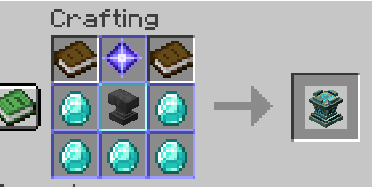
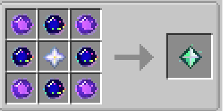
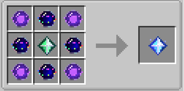
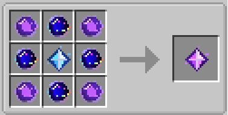
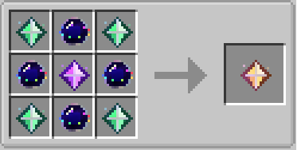
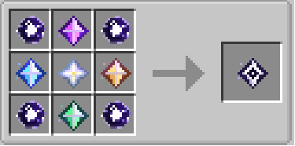
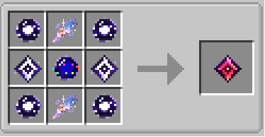

# Recipe compendium

Every recipe is shaped: place each ingredient in the exact slot shown.

## Aster Table

{ .recipe-image }

The top-center slot accepts any Aster Core tier.

## Dust of Enlightenment

{ .recipe-image }

Cost: 8 Resonance Core V + 1 Feather → 1 Dust.

## Resonance Core I

{ .recipe-image }

## Resonance Core II

{ .recipe-image }

## Resonance Core III

{ .recipe-image }

## Resonance Core IV

{ .recipe-image }

## Resonance Core V

{ .recipe-image }

## Resonance Core VI

{ .recipe-image }

!!! warning "Core VI exact Dust count"
    The shaped pattern contains Dust in two positions, so it consumes **2 Dust**, not four. It also consumes 4 Tier I Aster Cores, 1 Tier II Aster Core, and 2 Resonance Core V.

## Server customization

Server owners can replace these recipes with a datapack. The Aster Table itself still accepts only Aster Cores, Dust of Enlightenment, and Resonance Cores as upgrade materials.
