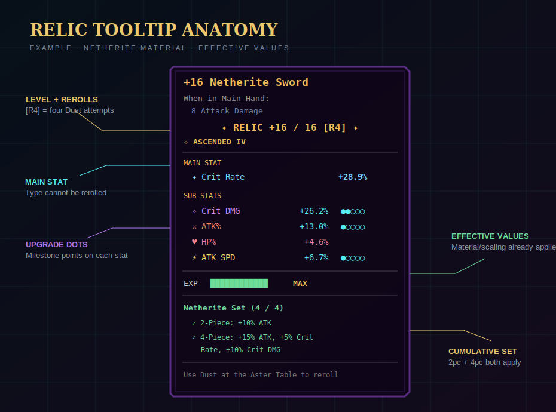

# Relics explained

A relic is an eligible ItemStack carrying a `SolsRelicData` payload. Rarity is supplied by Sol's Item Rarity; Relic System adds progression and stats on top of it.

## Anatomy of a relic

{ .game-shot }

| Part | What it controls |
|---|---|
| Rarity | Starting sub-stat count and maximum relic level |
| Main stat | One slot-specific stat that grows every level |
| Sub-stats | Up to four distinct secondary stat types |
| Upgrade dots/count | How many milestone points landed on each sub-stat |
| Level | Current progression from +0 to the rarity cap |
| Relic EXP | Stored progress toward the next level |
| Upgrade seed | Locks every normal milestone result to this relic |
| Reroll count | Number of completed Dust attempts, even if Keep Old was chosen |
| Ascension state | Whether ascended and which Resonance Core level produced it |

## Rarity progression

| Rarity | Starting sub-stats | Maximum level | Milestones available |
|---|---:|---:|---|
| <span class="rarity rarity--common">Common</span> | 0 | +4 | +4 |
| <span class="rarity rarity--uncommon">Uncommon</span> | 0–1 | +4 | +4 |
| <span class="rarity rarity--rare">Rare</span> | 1–2 | +9 | +4, +8 |
| <span class="rarity rarity--epic">Epic</span> | 2–3 | +12 | +4, +8, +12 |
| <span class="rarity rarity--legendary">Legendary</span> | 3–4 | +16 | +4, +8, +12, +16 |
| <span class="rarity rarity--mythical">Mythical</span> | 3–4 | +20 | +4, +8, +12, +16, +20 |
| <span class="rarity rarity--supreme">Supreme</span> | 4 | +24 | +4, +8, +12, +16, +20, +24 |

The code also contains a fixed-count helper, but normal assignment and ascension use the **random range** above.

## When data is assigned

The server queues assignment while it processes player equipment/inventory and before relevant Aster Table operations. A new eligible stack receives rarity if needed, then a relic seed and stats. The result belongs to that stack; normal milestones are not rolled at the instant you click upgrade.

## Raw values versus effective values

The stat enum stores raw roll values. Tooltips and previews call `RelicStatDisplay`, which applies:

```text
effective = raw × material multiplier × stat-scaling multiplier × hand efficiency
```

- Material multiplier ranges from **0.45** (wood/leather) to **1.12** (netherite).
- ATK/DEF/HP flat and percent stats have configurable scaling; defaults are usually 0.7, except flat ATK at 0.5.
- Offhand contribution defaults to 50%.
- Speed stats are finally subject to total caps.

This is why two relics with identical stored rolls can display different effective contributions.

## The three kinds of randomness

1. **Initial roll:** main stat, number/types/values of starting sub-stats.
2. **Milestone path:** deterministic from the relic seed and milestone level.
3. **Dust redistribution:** deliberately non-deterministic and performed only after the Dust is committed.

Ascension uses a stable seed derived from the item, rarity transition, core level, ascension level, main stat, and sub-stat types. Reopening the same preview is therefore not a reroll exploit.

