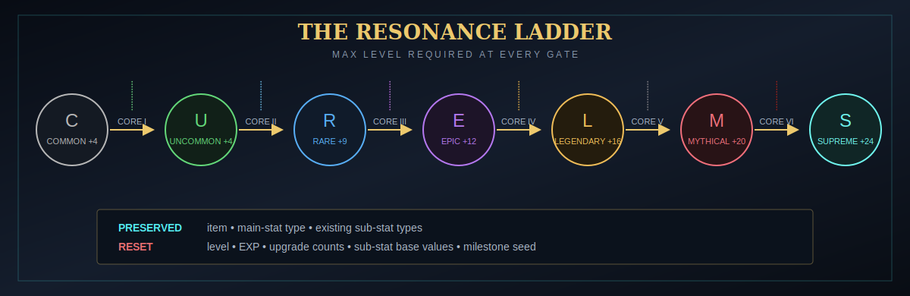

# Resonance ascension

Ascension raises one max-level relic by exactly one rarity. It does not skip tiers.

{ .game-shot }

## Core mapping

| Core | Required current rarity | Target rarity |
|---|---|---|
| Resonance Core I | Common | Uncommon |
| Resonance Core II | Uncommon | Rare |
| Resonance Core III | Rare | Epic |
| Resonance Core IV | Epic | Legendary |
| Resonance Core V | Legendary | Mythical |
| Resonance Core VI | Mythical | Supreme |

  

<small>Core I</small>

  

<small>Core II</small>

  

<small>Core III</small>

  

<small>Core IV</small>

  

<small>Core V</small>

  

<small>Core VI</small>

## Requirements

The server accepts an ascension only when all are true:

1. The left slot contains relic data.
2. It is not a special relic whose fixed behavior disallows the standard path.
3. Its current rarity exactly matches the core's source rarity.
4. It is at the maximum level for that rarity.
5. Its rarity is not fixed by Item Rarity or a set-ID fixed-rarity rule.
6. The item's configured rarity pool can reach the requested target.
7. The correct core remains in the table and inventory can accept the result.

## What ascension preserves

- Item identity, enchantments, durability, name, and unrelated stack data
- Main-stat **type**
- Existing sub-stat **types**, up to the configured maximum
- A marker that the relic was ascended and the latest Core level

## What ascension resets or rerolls

- Rarity becomes the target tier.
- Relic level resets to +0.
- Stored Relic EXP resets to 0.
- Main-stat value recalculates at +0.
- Every preserved sub-stat gets a fresh one-of-four base value.
- All sub-stat upgrade counts reset to zero.
- If the target rarity's rolled starting-slot count exceeds the preserved count, new distinct types are added.
- A new stable upgrade seed is assigned for the next leveling path.

!!! warning "Ascension erases milestone distribution"
    Dust redistribution and ordinary milestone upgrade counts do not survive. If you know you will ascend, do that before spending premium Dust on the current rarity.

## Why the preview repeats

The ascension seed mixes item ID, set ID, original relic seed, current/target rarity, core level, previous ascension level, main stat, and sub-stat types. Canceling and reinserting the unchanged relic with the same core produces the same preview. Change comes from legitimately changing the relic's state, not reopening the UI.

## How to ascend

1. Max the relic for its current rarity.
2. Obtain/craft the matching Resonance Core.
3. Put the relic left and one core right in the Aster Table.
4. Compare current stats with the target +0 roll.
5. Confirm. The core is consumed and the target-rarity relic returns to inventory.
6. Level the relic again to use the new cap and milestones.

## Core crafting chain

- Core I: Tier III and Tier II Aster Cores around a Nether Star.
- Cores II–III: the previous core surrounded by alternating Tier III/Tier II cores.
- Core IV: Core III centered with Tier II and Core I around it.
- Core V: Core IV, III, II, I, a Nether Star, and Tier I Aster Cores.
- Core VI: two Core V, four Dust, two Tier I cores, and one Tier II core.

See [Recipes](../reference/recipes.md) for exact 3×3 layouts.

