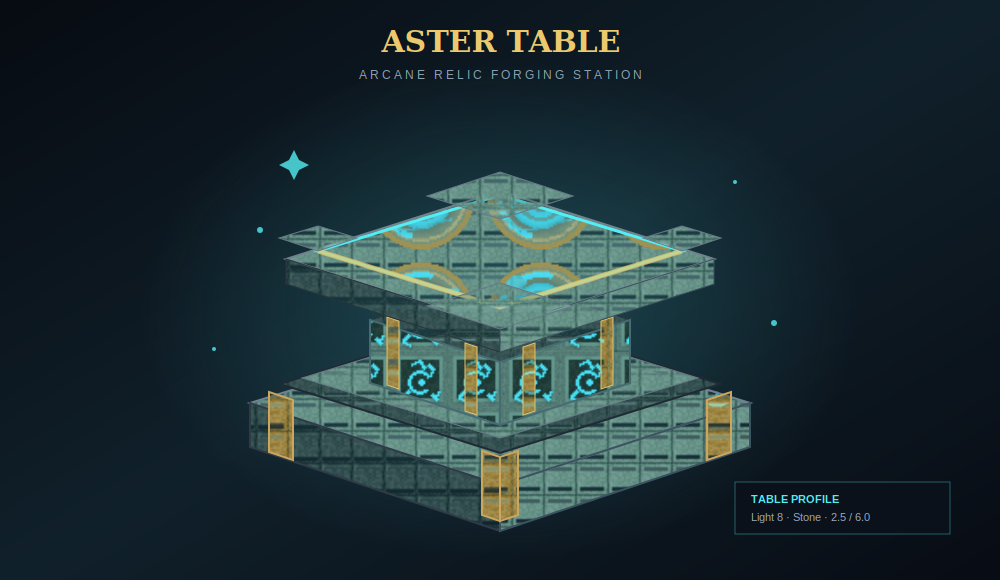
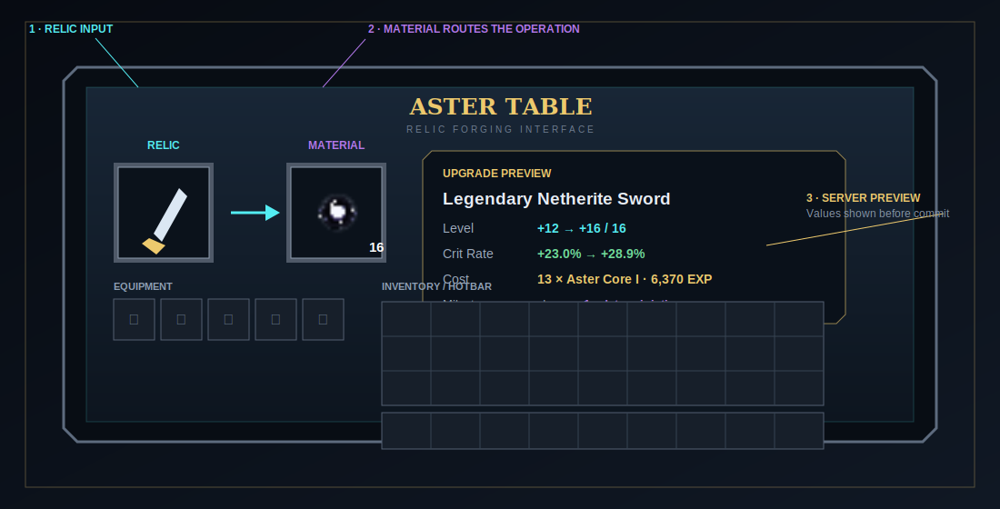

# Aster Table

The Aster Table is the central workstation. It routes the material in its right slot to one of three server-authoritative flows.

{ .game-shot }

| Right-slot material | Operation |
|---|---|
| Aster Core I–III | Add Relic EXP and process crossed milestones |
| Dust of Enlightenment | Reroll a finished relic's upgrade-point distribution |
| Resonance Core I–VI | Raise a max-level relic one matching rarity step |

## Crafting

  
Book

Any Aster Core

Book

  
Diamond

Anvil

Diamond

  
Diamond

Diamond

Diamond

The top-center ingredient is the tag `solsrelicsystem:aster_cores`; datapacks may extend that tag.

## Screen layout

{ .game-shot }

- **Relic slot:** accepts an eligible relic candidate.
- **Material slot:** accepts only Aster Cores, Dust, or Resonance Cores.
- **Equipment strip:** exposes equipped armor/offhand positions for management.
- **Preview area:** shows current → result levels and effective stat changes before commitment.
- **Confirmation overlay:** blocks unrelated input until accepted or canceled.

Shift-click routing prefers the material slot for recognized materials, the relic slot for eligible gear, then appropriate equipment/inventory slots.

## Leveling behavior

For Aster Cores, the table finds the smallest useful number of cores, previews deterministic milestone steps, and asks for confirmation. On success it puts an upgraded copy into inventory and consumes only that many cores. If more cores can fund another level, Upgrade Again starts the next cycle.

## Ascension behavior

A Resonance Core preview compares old and target rarity, current/max level, and every stat before versus the new +0 state. The server verifies the relic, core level, snapshots, stable seed, and inventory capacity again on confirmation.

## Reroll behavior

Dust opens a two-stage flow:

1. confirm consumption and any pity selections;
2. watch the result, compare Old versus New, and choose one.

The server holds recovery copies during the choice phase. Disconnect recovery returns the original relic and consumed Dust.

## Physical properties

The block code gives the table:

- 2.5 hardness and 6 blast resistance;
- stone sound;
- light level 8;
- a custom non-full-cube collision shape;
- cyan/gold ambient particles;
- horizontal facing based on placement.

It requires the correct tool for drops.

