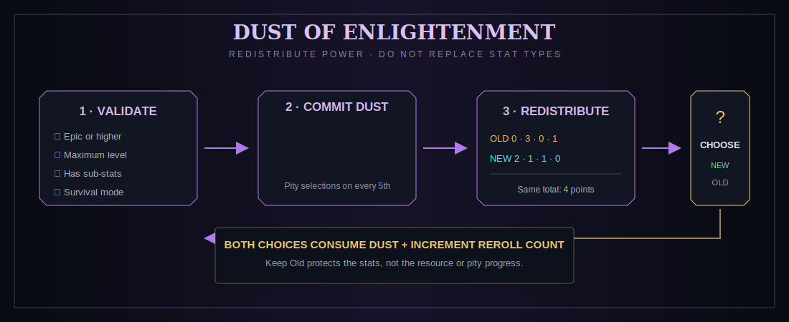

# Dust of Enlightenment

<div class="gallery-row"><div class="item-frame"><div class="item-sprite item-sprite--dust"></div><small>Dust of Enlightenment</small></div></div>

Dust is an endgame redistribution tool. It does **not** roll a new stat set.

{ .game-shot }

## Eligible relics

- Epic rarity or higher
- At the rarity's maximum relic level
- Has at least one sub-stat
- Standard/supported special-relic reroll behavior
- Used in survival; the flow rejects Creative mode

## What is redistributed

The reroll counts all upgrade points across the relic's sub-stats, then generates a new allocation with the exact same total.

```text
old: Crit DMG +0 | ATK% +3 | HP% +0 | Luck +1   (4 points)
new: Crit DMG +2 | ATK% +1 | HP% +1 | Luck +0   (4 points)
```

For each stat:

- if its new upgrade count equals its old count, its numeric value is unchanged;
- if the count changes, value scales proportionally:

```text
new value = old value × (new upgrades + 1) / (old upgrades + 1)
```

Therefore Dust preserves main stat, sub-stat types, level, rarity, and the total number of milestone points. It changes where those points live.

## Pity system

Default threshold: every **5th completed reroll** on the same relic.

On a pity attempt, the UI lets you select two sub-stats. Guaranteed points are randomly split between those two before all remaining points are distributed across every sub-stat.

| Rarity | Guaranteed selected-stat points |
|---|---:|
| Epic | up to 2 |
| Legendary | up to 3 |
| Mythical | up to 3 |
| Supreme | up to 3 |

“Up to” matters: a relic cannot guarantee more points than it possesses in total.

## Keep New versus Keep Old

After the roll, the overlay compares both versions. Either choice returns a relic:

- **Keep New:** saves the redistributed counts/values.
- **Keep Old:** restores the original stats.

Both choices consume one Dust and increment the relic's reroll counter because the attempt occurred. Keeping Old still advances toward the next pity attempt.

## Safety behavior

Inputs are consumed before the result is offered, while the server keeps copies of the original relic and Dust. If computation fails or the player disconnects before choosing, recovery returns both. If inventory is full after a choice, the relic drops at the player rather than disappearing.

## Sources

### Default mob rates

| Mob | Chance on direct player kill |
|---|---:|
| Ender Dragon | 8% |
| Warden | 5% |
| Wither | 3% |
| Elder Guardian | 2% |
| Ravager | 1% |
| Piglin Brute | 0.5% |
| Vindicator | 0.5% |

### Default chest rates

| Category | Chance |
|---|---:|
| Common vanilla | 1% |
| Rare vanilla | 3% |
| Modded chest namespace | 3% |
| Ancient City / ice box | 5% |
| End City treasure | 7% |

### Crafting

{ .recipe-image }

One Dust can be crafted with **eight Resonance Core V** around a feather, making it a deliberately expensive endgame recipe.

## Spending advice

1. Never use Dust to fix bad stat types—it cannot.
2. Ascend first if ascension is planned; it clears upgrade counts.
3. A relic with more milestone points gives Dust more meaningful distributions.
4. Time the fifth attempt for two stats you are happy to receive.
5. Judge the actual effective values, not only the +N dots.
