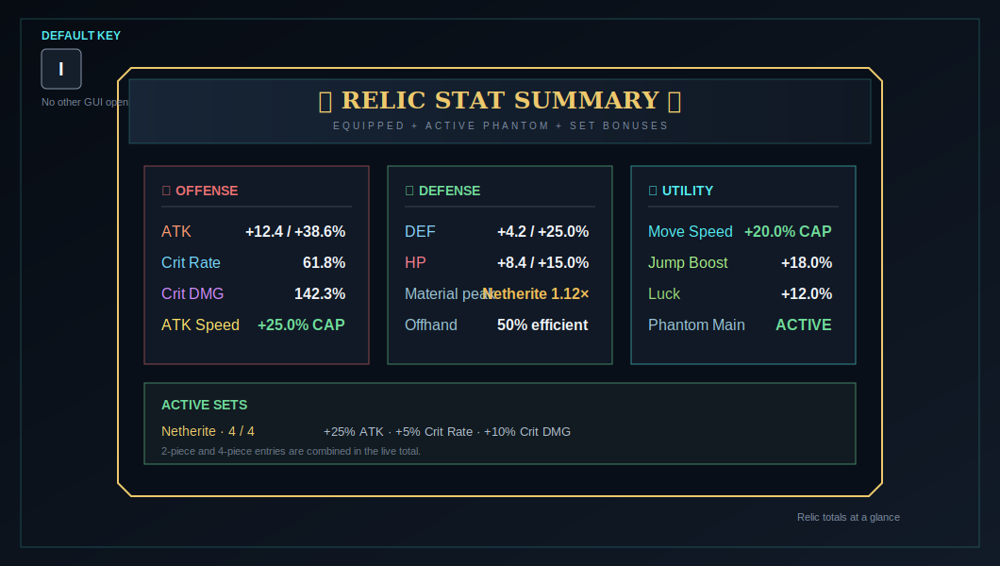

# Screens and tooltips

## Relic tooltip

{ .game-shot }

The handler inserts its section before the late vanilla/mod tooltip tail. At defaults it contains:

1. relic level/cap and `[R#]` reroll counter;
2. ascension line with Roman numeral when ascended;
3. main-stat section;
4. sub-stat section with effective values and up to five upgrade dots;
5. locked `???` rows for future slots;
6. EXP bar or MAX state;
7. armor set section when applicable;
8. Aster Table leveling/reroll hint.

The main item name can be prefixed with its `+level` when `showLevelInName` is enabled.

## Stat Summary

Press ++i++ while no other GUI is open. The key can be changed under Controls → Sol's Relic System.

{ .game-shot }

The screen aggregates effective equipped/phantom stats, base Crit values, caps, and active sets. The command equivalent is `/srs stats`.

## Upgrade confirmation

Inserting Aster Cores opens a preview before material consumption. It shows:

- item and rarity color;
- current → resulting level;
- main-stat current → resulting value;
- cores and total EXP consumed;
- number of milestones crossed;
- current sub-stats;
- whether another upgrade cycle is affordable.

After success, milestone sequences show each crossed level and the new/upgraded stat.

## Ascension preview

The ascension overlay compares current rarity and stats against the target +0 relic. It is safe to cancel; consumption occurs only after server revalidation.

## Dust comparison

Dust has a confirmation/pity-selection phase, animated redistribution, and an Old versus New choice. Input is intentionally blocked during modal phases to keep client/server state synchronized.

## Recycling preview

`/srs recycle` shows the held relic and exact Tier III core refund. It does not destroy the item until confirmation and revalidation.

!!! note "About relic locking"
    In v1.56, the only available Sol's Relic System keybind is ++i++ for Stat Summary. Older references to relic locking or an R/X key do not apply to this version.
