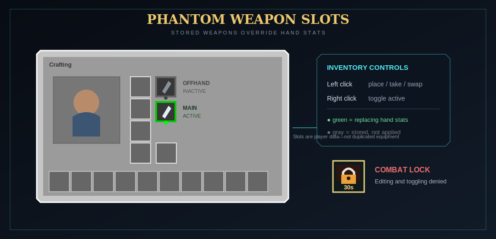

# Phantom weapon slots

Phantom slots let a stored weapon replace the relic **stats** collected from a real hand without forcing that weapon to be visibly held. There are separate main-hand and offhand phantom slots.

{ .game-shot }

## Add a weapon

1. Open the normal inventory or Creative inventory.
2. Find the two extra bordered slots near the equipment/offhand area.
3. Pick up a valid detected weapon with the cursor.
4. Left-click a phantom slot to place or swap it.
5. Right-click the slot to toggle it active (green) or inactive (gray).

Left-click an occupied slot with an empty cursor to take its weapon back.

## What “active” means

- Active main phantom replaces the real main-hand item for relic stat collection.
- Active offhand phantom replaces the real offhand item for relic stat collection.
- Armor is unaffected.
- Offhand phantom stats still receive the default 50% offhand efficiency.

The stored weapon itself remains in the phantom attachment. Its stats are used; it is not a duplicate held item.

## Hand restrictions

While an active phantom weapon overrides a hand, another restricted weapon cannot remain in that real hand. The enforcement code moves a conflicting main-hand weapon into inventory (or drops it if full) and selects an allowed hotbar slot; an offhand conflict is returned to inventory or dropped.

Utility tools are allowed in the real hand because they are not restricted weapons. This enables, for example, a phantom combat weapon's stats while visibly using a mining tool.

## Combat lock

Default lock duration: **30 seconds**.

Dealing damage to another entity or being damaged by a living attacker marks combat. During the window:

- editing and toggling phantom slots is rejected;
- slot borders turn red;
- a countdown badge appears by the left side of the hotbar by default.

The server may set the duration to 0, move the badge to another anchor, offset it, or allow Game Master operators to bypass it. Operator bypass is disabled by default.

## Death and persistence

Phantom contents persist with the player data. On death:

- with `keepInventory` enabled, they remain stored;
- without it, both stored phantom items are dropped with a pickup delay and the slots are cleared.

## Valid items

The same current weapon detector used by relic eligibility validates a phantom item. Ordinary utility tools are not valid phantom weapons unless they enter through a recognized/whitelisted weapon integration path.

